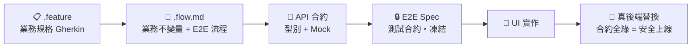

<div align="center">


[](https://github.com/PinyiW0)
[](https://github.com/PinyiW0)
[](https://github.com/PinyiW0)

</div>

## About Me

```typescript
const pinyi = {
  role: 'Frontend Engineer',
  focus: ['Vue 3', 'Nuxt 4', 'TypeScript', 'SDD', 'AI-Native Workflow'],
  belief: '規格與測試合約先行，AI 才能放心把程式碼寫完',
  highlights: [
    '以 SDD 管線獨立打造並上線婚禮管理 SaaS（41 規格 → 189 E2E 全綠）',
    'Nuxt 3 → 4 升級與標準化模板建立',
    '將 LLM 內建進團隊工程流程（Prompt 邊界 + AI Code Review 防線）',
  ],
  communities: ['六角學院專題教練', '12 週成長計劃主辦人'],
  motto: '能做也能教',
}
```


<br />

## How I Build — SDD（Spec-Driven Development）

我的開發從規格出發，不從畫面出發。測試先凍結成合約，之後 UI 怎麼改、後端怎麼換，**綠燈就是安全線**。



| Repo | 角色 |
|------|------|
| [Nuxt4-template-SDD](https://github.com/PinyiW0/Nuxt4-template-SDD) | SDD 工作流模板 — 專案起手式（Claude Code Skills + 規格目錄 + E2E 守門） |
| [wedding-host](https://github.com/PinyiW0/wedding-host) | 全流程實戰 — 41 支規格一路走到正式上線 |
| [TeruTeru](https://github.com/PinyiW0/TeruTeru) | 練習場 — 規格 → 測試 → UI 的完整演練 |


<br />

## Featured Projects

### 💍 EverAfter — 婚禮管理 SaaS ｜ 個人開發・已上線
> SDD 全流程實證：41 支 Gherkin 規格 → 業務流程文件 → API 合約 → 凍結 E2E 測試 → UI → 真後端
> **189 支 Playwright 測試全綠** · 4 角色／多租戶 · 16+ 業務模組（賓客、RSVP、座位圖、現場報到、喜餅、祝福牆⋯）
> 後端（PostgreSQL + Drizzle、JWT/RBAC）以 AI 協作完成——凍結的測試合約守住每一次替換，前端零改動

**Tech:** Nuxt 4 · TypeScript · Playwright · Vercel + Neon + Cloudflare R2

[Live Demo](https://everafter-iota.vercel.app) · [GitHub Repo](https://github.com/PinyiW0/wedding-host)

### ☀️ TeruTeru 放晴吧 — 祈求好天氣平台 ｜ SDD 練習場
> 完整走一遍 SDD 工作流：`spec/gherkin-feature` → `e2e-flows` → Playwright 測試 → UI
> 搭配 OpenSpec 變更提案管理，Docker 容器化開發環境

**Tech:** Nuxt 4 · TypeScript · Playwright · OpenSpec · Docker

[GitHub Repo](https://github.com/PinyiW0/TeruTeru)

### 💡 DreamBoost 夢想家募資網 ｜ 團隊合作：組長・前端・UI 設計
> 以 Airbnb 風格建立團隊開發規範，整合第三方套件完成募資平台

**Tech:** Vue 3 · Bootstrap 5 · Vite

[GitHub Repo](https://github.com/PinyiW0/DreamBoost/tree/main) · [Live Demo](https://pinyiw0.github.io/DreamBoost/#/)

<details>
<summary>更多作品</summary>

- [享樂酒店訂房平台](https://github.com/PinyiW0/hotelBookingWeb) — Nuxt 3 · MongoDB · SEO 優化（Demo 暫不開放）
- [搜趣找喵](https://github.com/PinyiW0/project_SearchforMeow) — 流浪動物收容所檢索網

</details>

<br />

## Writing

技術寫作在 [Medium](https://medium.com/@wpypy8) — 聚焦 AI 協作工程與 Nuxt 深度主題：

- [教 AI 理解你的經驗：用 Claude Skill 與 Hook 建立工程思維系統](https://medium.com/p/102f4ec97a5a)
- [Skill 核心概念：總廚師長與他的專業廚師團隊](https://medium.com/p/43122638daa0)
- [Nuxt 4 的資料層重寫：從 Data Fetching 行為改變看框架設計思路](https://medium.com/p/47183a703ab7)
- [當兩年前端成了面試官：在 AI 浪潮的焦慮中，我從資深開發者身上看見未來的樣子](https://medium.com/p/da71bf73543e)


<br />


## Tech Stack

<div align="center">

[](https://skillicons.dev)

</div>

| 領域 | 技術 |
|------|------|
| **核心框架** | Vue 3 · Nuxt 4 · TypeScript · Vite |
| **樣式 / UI** | Nuxt UI · Tailwind CSS · UnoCSS · SCSS |
| **測試 / 品質** | Playwright E2E · 測試合約（凍結 Spec）· ESLint + vue-tsc |
| **工程實踐** | SDD 規格驅動 · SSR/SSG · SEO · i18n · GTM/GA · Git Flow · GitHub Actions |
| **AI 工程化** | Claude Code · Skills / MCP · Context Engineering · Prompt 邊界 + AI Code Review 防線 |
| **學習中** | 後端基礎 — PostgreSQL · Drizzle · Docker（以 AI 協作實戰中，持續補概念） |


<br />

## Currently

- 💍 打造 EverAfter 婚禮管理 SaaS — SDD 全流程的實驗場
- 📐 打磨 [Nuxt4-template-SDD](https://github.com/PinyiW0/Nuxt4-template-SDD) — 把 SDD 工作流變成可複用模板
- 🤖 研究 AI 輔助開發流程（Claude Code + Skills + MCP）
- 🏫 擔任六角學院程式專題教練，指導學員實戰開發
- 📖 主辦 12 週成長計劃 — 前端技術研究、自我規劃與 AI 技術討論
- 🎤 AI 講座分享，推廣 LLM 在工程流程中的實際應用


<br />


## Connect

<div align="center">

[](mailto:wpypy8@gmail.com)
[](https://github.com/PinyiW0)
[](https://medium.com/@wpypy8)

</div>


